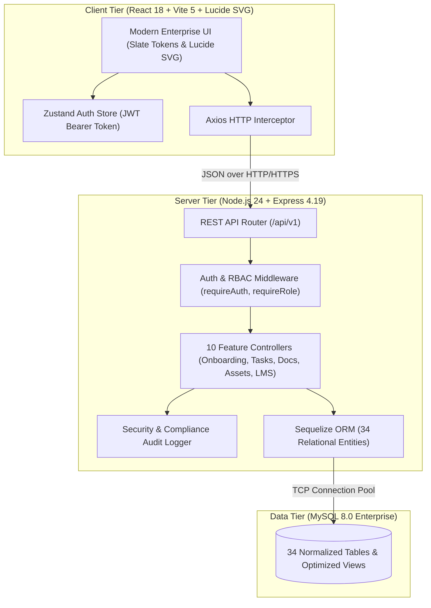

<div align="center">

# 🏢 Enterprise Onboarding Management System (EOMS)

**A mission-critical, enterprise-grade onboarding and statutory compliance platform built for high-growth modern technology organizations.**

[](docs/RELEASES.md)
[](LICENSE)
[](https://nodejs.org/)
[](https://react.dev/)
[](https://vitejs.dev/)
[](https://www.mysql.com/)
[](server/tests/)

</div>

---

## 📌 Executive Overview

The **Enterprise Onboarding Management System (EOMS)** is a comprehensive full-stack solution architected to eliminate administrative friction across People Operations, IT Infrastructure, Department Leadership, and Legal Compliance.

Engineered with deep statutory alignment for the **Indian Corporate Ecosystem** (Aadhaar e-KYC, PAN validation, EPFO Form 11, and the POSH Act 2013), EOMS automates the complete employee integration lifecycle—from pre-boarding offer acceptance to Day-30 independent delivery.

---

## 🏗️ System Architecture



---

## ✨ Key Capabilities

| Domain | Core Features |
| :--- | :--- |
| **🚀 Phased Onboarding** | Milestone-driven cohorts (`Pre-Boarding`, `Day One`, `Week One`, `Month One`) with automated progress percentage recalculation upon task completion. |
| **📑 Statutory Document Compliance** | Structured verification queue for Indian regulatory filings: Permanent Account Number (PAN), Aadhaar, EPFO Form 11, and educational degrees with auditor notes. |
| **💻 IT Asset Lifecycle** | End-to-end hardware provisioning (MacBook Pro M3, 4K Displays, YubiKey NFC), inventory tracking, and employee digital handover acknowledgements. |
| **🎓 Corporate LMS & Training** | Mandatory regulatory courses including **POSH Act 2013 (Prevention of Sexual Harassment)** and Information Security / GDPR, with quiz scoring and completion badges. |
| **🛡️ Enterprise RBAC** | 10-tier organizational hierarchy (`SYSTEM_ADMIN` down to `PAYROLL_ADMIN`) with granular action rights and sub-millisecond cached permission guards. |
| **📊 Executive Observability** | Aggregate dashboard analytics, department-level completion distributions, and an immutable security audit trail capturing client IP and user-agent metadata. |

---

## 👥 Demo Personas & Credentials

All demo accounts are pre-seeded with password: `Password@123`

| Persona | Role | Email / Username | Hub Location | Core Responsibilities |
| :--- | :--- | :--- | :--- | :--- |
| **Rajesh Nambiar** | `SYSTEM_ADMIN` | `admin` | Bengaluru | Platform administration, permissions, settings |
| **Priya Patel** | `HR_ADMIN` | `priya.patel` | Bengaluru | Head of People Operations, cohort creation, new hires |
| **Rohan Verma** | `IT_ADMIN` | `rohan.verma` | Pune | Hardware asset allocation, serial tracking, provisioning |
| **Neha Nair** | `COMPLIANCE_OFFICER` | `neha.nair` | Gurugram | POSH compliance, statutory PAN/EPFO document auditing |
| **Vikram Malhotra** | `DEPARTMENT_MANAGER`| `vikram.malhotra`| Bengaluru | Engineering Director, team task oversight, buddy pairing |
| **Aarav Sharma** | `EMPLOYEE` | `aarav.sharma` | Hyderabad | New hire SDE-II, task checklist execution, training |

---

## 🛠️ Technology Stack

### Frontend Application
- **Runtime & Build**: React 18.3, Vite 5.4
- **Styling & Design System**: Modern Slate Theme (`tokens.css`), Glassmorphism, Inter Typography
- **Iconography**: Lucide React (Crisp scalable SVG vectors; 0 unicode emoji artifacts)
- **State Management**: Zustand (Stateless JWT session persistence)
- **HTTP Client**: Axios with automatic 401 interception

### Backend REST API
- **Runtime**: Node.js v24.12 LTS
- **Framework**: Express.js 4.19 (Modular routing, Helmet, CORS, Rate-Limiting)
- **ORM Layer**: Sequelize 6.37 (34 Models, parameterized queries, transaction safety)
- **Authentication**: Stateless JSON Web Tokens (HS256) & Bcrypt password hashing (10 rounds)
- **Testing Runner**: Node.js Native Test Runner (`node:test`, `node:assert/strict`)

### Database
- **Engine**: MySQL 8.0 Enterprise
- **Schema**: 34 normalized relational entities, strict foreign key constraints, and SQL views

---

## 🚀 Quickstart Guide

### Prerequisites
- **Node.js**: `v20.x`, `v22.x`, or `v24.x` (`v24.12.0` recommended)
- **MySQL Server**: `8.0+` running on port 3306

### 1. Clone the Repository
```bash
git clone https://github.com/sagegallant/EOMS.git
cd EOMS
```

### 2. Configure Environment & Database
Create `server/.env` with your MySQL credentials:
```env
PORT=5000
NODE_ENV=development
DB_HOST=127.0.0.1
DB_PORT=3306
DB_NAME=eoms
DB_USER=root
DB_PASS=your_mysql_password
JWT_SECRET=eoms_super_secret_jwt_key_change_in_production_2026
CLIENT_URL=http://localhost:5173
```

### 3. Run Database Migrations & Idempotent Seeder
```bash
cd server
npm install
npm run seed
```
*Seeds all 34 tables with 19 corporate personas, Indian tech hubs, statutory document types, courses, assets, and tasks.*

### 4. Start the Application
In terminal 1 (Backend REST API):
```bash
cd server
npm start
# ✔ EOMS API ready on port 5000
```

In terminal 2 (Frontend Web Application):
```bash
cd client
npm install
npm run dev
# ➜ Local: http://localhost:5173/
```

---

## 🧪 Automated Multi-Phase Testing Suite

EOMS features a comprehensive multi-phase test suite executed via Node's native test runner:

```bash
cd server

# Run the complete test suite (Unit, Integration & E2E - 24 passing tests)
npm test

# Run Unit tests only (Bcrypt hashing, JWT claims, RBAC guards, Sequelize schemas)
npm run test:unit

# Run Live REST API Integration tests (Endpoints, headers, role guards)
npm run test:integration

# Run 4-Persona E2E Lifecycle Simulation (HR -> IT -> New Hire -> Compliance)
npm run test:e2e
```

### Test Suite Execution Output
```
▶ E2E Lifecycle Test: 4-Persona Corporate Onboarding & Statutory Compliance Simulation
  ✔ Phase 1: Multi-Persona Authentication Gateways
  ✔ Phase 2: HR Admin provisions new employee & initializes onboarding plan
  ✔ Phase 3: IT Admin allocates workstation hardware to the new employee
  ✔ Phase 4: Employee completes task progress, statutory training, and uploads PAN card
  ✔ Phase 5: Compliance Officer audits and approves the statutory document with audit trail
✔ E2E Lifecycle Test: 4-Persona Corporate Onboarding & Statutory Compliance Simulation
▶ Integration Tests: EOMS REST API Endpoints
  ✔ GET /health returns 200 with system metadata
  ✔ POST /auth/login fails on invalid credentials with 401
  ✔ POST /auth/login succeeds for Indian HR Admin persona (Priya Patel)
  ✔ GET /employees requires authentication and returns data for authenticated admin
  ✔ GET /onboarding/templates returns active enterprise onboarding cohorts
  ✔ GET /reports/summary aggregates cross-functional organization metrics
  ✔ GET /tasks returns phased onboarding checklist tasks
✔ Integration Tests: EOMS REST API Endpoints
▶ Unit Tests: Authentication & Cryptographic Security
  ✔ Bcrypt Password Hashing & Verification
  ✔ JWT Generation, Signature Verification & Claims Payload
  ✔ JWT Expiration and Invalid Secret Handling
  ✔ MFA Challenge Token Structure
✔ Unit Tests: Authentication & Cryptographic Security
▶ Unit Tests: Sequelize Models & Schema Integrity
  ✔ Employee model attributes and table configuration
  ✔ OnboardingPlan model schema & status enums
  ✔ Task model attributes and priorities
  ✔ Document and Asset schema definitions
✔ Unit Tests: Sequelize Models & Schema Integrity
▶ Unit Tests: Role-Based Access Control (RBAC) Guards
  ✔ requireRole blocks unauthenticated requests with 401
  ✔ requireRole grants immediate bypass to SYSTEM_ADMIN superuser
  ✔ requireRole allows user with matching role
  ✔ requireRole forbids user without matching role with 403
✔ Unit Tests: Role-Based Access Control (RBAC) Guards
ℹ tests 24 | suites 5 | pass 24 | fail 0
```

---

## 📡 REST API Reference

| Method | Endpoint | Access Role | Description |
| :--- | :--- | :--- | :--- |
| `POST` | `/api/v1/auth/login` | Public | Authenticates credentials, returns signed JWT & role claims |
| `GET` | `/api/v1/auth/me` | Authenticated | Retrieves current authenticated session user & active roles |
| `GET` | `/api/v1/employees` | Authenticated | Lists all employees with position, department, and onboarding progress |
| `POST` | `/api/v1/employees` | `HR_ADMIN`, `HR_SPECIALIST` | Registers new employee and automatically initializes onboarding plan |
| `GET` | `/api/v1/onboarding` | Authenticated | Lists active onboarding cohorts, progress, and target completion dates |
| `GET` | `/api/v1/tasks` | Authenticated | Retrieves phased checklist tasks and per-employee progress |
| `PATCH`| `/api/v1/tasks/:id/progress` | Authenticated | Updates task progress and auto-recalculates plan progress percent |
| `GET` | `/api/v1/documents` | Authenticated | Lists statutory compliance submissions and verification states |
| `POST` | `/api/v1/documents/upload` | Authenticated | Uploads regulatory filing and queues for compliance audit |
| `PATCH`| `/api/v1/documents/:id/verify` | `COMPLIANCE_OFFICER`, `HR_ADMIN` | Approves or rejects statutory document with reviewer audit notes |
| `GET` | `/api/v1/assets` | Authenticated | IT hardware inventory and allocation status catalog |
| `POST` | `/api/v1/assets/allocate` | `IT_ADMIN` | Allocates equipment to new hire and dispatches in-app notification |
| `PATCH`| `/api/v1/assets/allocations/:id/acknowledge`| Authenticated | Employee acknowledges physical receipt of provisioned equipment |
| `GET` | `/api/v1/training/courses` | Authenticated | Catalog of regulatory courses (POSH Act 2013, InfoSec) |
| `POST` | `/api/v1/training/progress`| Authenticated | Records module scores and marks regulatory training completed |
| `GET` | `/api/v1/reports/summary` | HR, IT, Compliance, Managers | Real-time aggregate KPIs across headcount, compliance, and assets |
| `GET` | `/api/v1/audit` | `SYSTEM_ADMIN`, `COMPLIANCE_OFFICER` | Searchable immutable audit trail of all platform activities |
| `GET` | `/api/v1/settings` | Authenticated | Enterprise configuration and compliance deadline settings |

---

## 🚢 Containerized Deployment

Deploy the full stack using Docker Compose:

```bash
cd deployment
docker-compose up --build -d
```

Or execute the automated deployment script:
- **Linux/macOS**: `./deployment/deploy.sh`
- **Windows**: `powershell -ExecutionPolicy Bypass -File deployment/deploy.ps1`

---

## 📜 Community & Governance

- [Code of Conduct](CODE_OF_CONDUCT.md)
- [Contributing Guidelines](CONTRIBUTING.md)
- [Security Policy](SECURITY.md)
- [Release Changelog](docs/RELEASES.md)
- [System Architecture](docs/ARCHITECTURE.md)

---

## 📄 License

This project is open-source software licensed under the [MIT License](LICENSE).
Copyright (c) 2026 EOMS Contributors.
