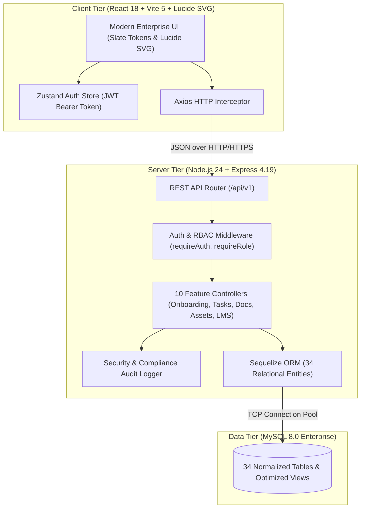

<div align="center">

# 🏢 Employee Onboarding Management System (EOMS)

**A mission-critical onboarding and statutory compliance platform built for high-growth modern technology organizations.**

[](docs/RELEASES.md)
[](LICENSE)
[](https://nodejs.org/)
[](https://react.dev/)
[](https://vitejs.dev/)
[](https://www.mysql.com/)
[](server/tests/)

</div>

---

## 📌 Executive Overview

The **Employee Onboarding Management System (EOMS)** is a comprehensive full-stack solution architected to eliminate administrative friction across People Operations, IT Infrastructure, Department Leadership, and Legal Compliance.

Engineered with deep statutory alignment for the **Indian Corporate Ecosystem** (Aadhaar e-KYC, PAN validation, EPFO Form 11, and the POSH Act 2013), EOMS automates the complete employee integration lifecycle—from pre-boarding offer acceptance to Day-30 independent delivery.

---

## 🏗️ System Architecture


```mermaid
graph TD
    subgraph Client ["Client Tier (React 18 + Vite 5 + Lucide SVG)"]
        UI["Modern Enterprise UI (Slate Tokens & Lucide SVG)"]
        Store["Zustand Auth Store (JWT Bearer Token)"]
        AxiosClient["Axios HTTP Interceptor"]
        UI --> Store
        UI --> AxiosClient
    end

    subgraph Server ["Server Tier (Node.js 24 + Express 4.19)"]
        Gateway["REST API Router (/api/v1)"]
        AuthMid["Auth & RBAC Middleware (requireAuth, requireRole)"]
        Controllers["10 Feature Controllers (Onboarding, Tasks, Docs, Assets, LMS)"]
        AuditService["Security & Compliance Audit Logger"]
        ORM["Sequelize ORM (34 Relational Entities)"]
        
        Gateway --> AuthMid
        AuthMid --> Controllers
        Controllers --> AuditService
        Controllers --> ORM
    end

    subgraph Database ["Data Tier (MySQL 8.0 Enterprise)"]
        DB[("34 Normalized Tables & Optimized Views")]
        ORM -->|TCP Connection Pool| DB
    end

    AxiosClient -->|JSON over HTTP/HTTPS| Gateway
```

---

## ✨ Key Capabilities

| Domain | Core Features |
| :--- | :--- |
| **🚀 Phased Onboarding** | Milestone-driven cohorts (`Pre-Boarding`, `Day One`, `Week One`, `Month One`) with automated progress percentage recalculation upon task completion. |
| **📑 Statutory Document Compliance** | Structured verification queue for Indian regulatory filings: Permanent Account Number (PAN), Aadhaar, EPFO Form 11, and educational degrees with auditor notes. |
| **💻 IT Asset Lifecycle** | End-to-end hardware provisioning (MacBook Pro M3, 4K Displays, YubiKey NFC), inventory tracking, and employee digital handover acknowledgements. |
| **🎓 Corporate LMS & Training** | Mandatory regulatory courses including **POSH Act 2013 (Prevention of Sexual Harassment)** and Information Security / GDPR, with quiz scoring and completion badges. |
| **🛡️ Enterprise RBAC** | 10-tier organizational hierarchy (`SYSTEM_ADMIN` down to `PAYROLL_ADMIN`) with granular action rights and sub-millisecond cached permission guards. |
| **📊 Executive Observability** | Aggregate dashboard analytics, department-level completion distributions, and an immutable security audit trail capturing client IP and user-agent metadata. |

---

## 👥 Demo Personas & Credentials

All demo accounts are pre-seeded with password: `Password@123`

| Persona | Role | Email / Username | Hub Location | Core Responsibilities |
| :--- | :--- | :--- | :--- | :--- |
| **Rajesh Nambiar** | `SYSTEM_ADMIN` | `admin` | Bengaluru | Platform administration, permissions, settings |
| **Priya Patel** | `HR_ADMIN` | `priya.patel` | Bengaluru | Head of People Operations, cohort creation, new hires |
| **Rohan Verma** | `IT_ADMIN` | `rohan.verma` | Pune | Hardware asset allocation, serial tracking, provisioning |
| **Neha Nair** | `COMPLIANCE_OFFICER` | `neha.nair` | Gurugram | POSH compliance, statutory PAN/EPFO document auditing |
| **Vikram Malhotra** | `DEPARTMENT_MANAGER`| `vikram.malhotra`| Bengaluru | Engineering Director, team task oversight, buddy pairing |
| **Aarav Sharma** | `EMPLOYEE` | `aarav.sharma` | Hyderabad | New hire SDE-II, task checklist execution, training |

---

## 🛠️ Technology Stack

### Frontend Application
- **Runtime & Build**: React 18.3, Vite 5.4
- **Styling & Design System**: Modern Slate Theme (`tokens.css`), Glassmorphism, Inter Typography
- **Iconography**: Lucide React (Crisp scalable SVG vectors; 0 unicode emoji artifacts)
- **State Management**: Zustand (Stateless JWT session persistence)
- **HTTP Client**: Axios with automatic 401 interception

### Backend REST API
- **Runtime**: Node.js v24.12 LTS
- **Framework**: Express.js 4.19 (Modular routing, Helmet, CORS, Rate-Limiting)
- **ORM Layer**: Sequelize 6.37 (34 Models, parameterized queries, transaction safety)
- **Authentication**: Stateless JSON Web Tokens (HS256) & Bcrypt password hashing (10 rounds)
- **Testing Runner**: Node.js Native Test Runner (`node:test`, `node:assert/strict`)

### Database
- **Engine**: MySQL 8.0 Enterprise
- **Schema**: 34 normalized relational entities, strict foreign key constraints, and SQL views

---

## 🚀 Quickstart Guide

### Prerequisites
- **Node.js**: `v20.x`, `v22.x`, or `v24.x` (`v24.12.0` recommended)
- **MySQL Server**: `8.0+` running on port 3306

### 1. Clone the Repository
```bash
git clone https://github.com/sagegallant/EOMS.git
cd EOMS
```

### 2. Configure Environment & Database
Create `server/.env` with your MySQL credentials:
```env
PORT=5000
NODE_ENV=development
DB_HOST=127.0.0.1
DB_PORT=3306
DB_NAME=eoms
DB_USER=root
DB_PASSWORD=your_mysql_password
JWT_SECRET=eoms_super_secret_jwt_key_change_in_production_2026
CLIENT_URL=http://localhost:5173
```

### 3. Run Database Migrations & Idempotent Seeder
```bash
cd server
npm install
npm run seed
```
*Seeds all 34 tables with 19 corporate personas, Indian tech hubs, statutory document types, courses, assets, and tasks.*

### 4. Start the Application
In terminal 1 (Backend REST API):
```bash
cd server
npm start
# ✔ EOMS API ready on port 5000
```

In terminal 2 (Frontend Web Application):
```bash
cd client
npm install
npm run dev
# ➜ Local: http://localhost:5173/
```

---

## 📊 Implementation Status & Engineering Scope

| Domain / Feature | Status | Details |
| :--- | :--- | :--- |
| **Authentication & Session** | **IMPLEMENTED** | Real bcrypt hashing, JWT issuance & verification, Bearer interceptors, auto 401 handling, session termination. |
| **MFA / TOTP Security** | **IMPLEMENTED** | RFC 6238 TOTP using `otplib` & `qrcode`, single-use bcrypt-hashed backup codes, development bypass removed. |
| **Employee Directory** | **IMPLEMENTED** | Full REST integration (`GET`, `POST`, `PATCH`), atomic user+plan+checklist provisioning, server-side search. |
| **Onboarding & Checklists** | **IMPLEMENTED** | Milestone workflows, atomic task progress updates, server-side progress calculation and plan status recalculation. |
| **IT Asset Lifecycle** | **IMPLEMENTED** | Pessimistic locking (`LOCK.UPDATE`) to eliminate race conditions, object-level authorization, employee digital acknowledgement. |
| **Statutory Documents** | **IMPLEMENTED** | Multipart upload via Multer, MIME/ext validation, path traversal guard, secure authorized download route. |
| **Training & LMS Quiz** | **IMPLEMENTED** | Server-side quiz evaluation (POSH Act 2013), tamper-proof score calculation, 80% passing threshold, attempt history. |
| **SLA & Overdue Automation** | **IMPLEMENTED** | Automated node scheduler checking overdue onboarding cohorts, dispatching notifications, and logging audit events. |
| **In-App Notifications** | **IMPLEMENTED** | Real database-backed notification stream, unread counts, mark-as-read, and automatic event dispatching. |
| **Audit Trail** | **IMPLEMENTED** | Append-only security logging capturing actor, action, target entity, client IP address, and browser user-agent. |
| **Aggregated Reporting** | **IMPLEMENTED** | Real SQL aggregate calculations for headcount, completion rates, asset utilization, and compliance audits. |
| **Object-Level Authorization** | **IMPLEMENTED** | Enforced across document downloads, asset acknowledgements, task progress updates, and user profiles. |
| **Database Transactions** | **IMPLEMENTED** | ACID transactions wrapping employee onboarding, asset allocation, document review, and task progression. |
| **Cloud Object Storage (S3/MinIO)** | **FUTURE SCOPE** | Document storage currently uses secure local filesystem abstraction; ready for S3/MinIO driver swap. |
| **Real-time WebSockets** | **FUTURE SCOPE** | Notifications and progress currently leverage active API revalidation and polling intervals. |

---

## 🔐 Security & Hardening Highlights

- **Anti-Concurrency Asset Locking**: Prevents double-allocation race conditions using `SELECT ... FOR UPDATE` row locks inside atomic Sequelize transactions.
- **Object-Level Access Control (BOLA/IDOR Prevention)**: Enforces ownership checks on sensitive operations (e.g., users cannot acknowledge another employee's hardware or view confidential PAN/Aadhaar cards).
- **Secure File Storage Layer**: Validates magic numbers and MIME types, sanitizes file paths to prevent directory traversal (`..`), and isolates statutory filings behind authorized streaming endpoints.
- **Statutory LMS Engine**: Guarantees answer keys are never delivered to the client and scores attempts authoritatively on the Express server.
- **Granular RBAC**: Sensitive routes enforce fine-grained permissions (`employee:write`, `asset:allocate`, `document:verify`, `audit:view`) rather than hardcoded role strings.

---

## 🧪 Automated Multi-Phase Testing Suite

EOMS features a comprehensive multi-phase test suite executed via Node's native test runner (48 automated tests):

```bash
cd server

# Run the complete test suite (Unit, Integration, Comprehensive & E2E - 48 passing tests)
npm test

# Run Unit tests only (Bcrypt hashing, JWT claims, RBAC guards, Sequelize schemas - 12 tests)
npm run test:unit

# Run Live REST API Integration tests & Comprehensive Workflows (31 tests)
npm run test:integration

# Run 4-Persona E2E Lifecycle Simulation (5 multi-step phases)
npm run test:e2e
```

### Test Suite Execution Output
```
✔ Unit Tests: Authentication & Cryptographic Security (4 tests)
✔ Unit Tests: Sequelize Models & Schema Integrity (4 tests)
✔ Unit Tests: Role-Based Access Control (RBAC) Guards (4 tests)
✔ Integration Tests: EOMS REST API Endpoints (7 tests)
✔ Comprehensive Enterprise Workflows & Security Verification (24 tests)
  - Authentication & Session Security (4 tests)
  - RBAC & Granular Permission Enforcement (3 tests)
  - Employee Management & Onboarding Plan Initialization (3 tests)
  - Real Onboarding Progress & Task Tracking (2 tests)
  - Asset Allocation, Concurrency & Object-Level Authorization (4 tests)
  - Document Workflow, Verification & Access Control (3 tests)
  - Server-Side Training Quiz Engine (3 tests)
  - Aggregated Reporting & Audit Trail (2 tests)
✔ E2E Lifecycle Test: 4-Persona Corporate Onboarding & Statutory Compliance Simulation (5 phases)

ℹ tests 48 | suites 14 | pass 48 | fail 0
```

---

## 📡 REST API Reference

| Method | Endpoint | Required Permission | Description |
| :--- | :--- | :--- | :--- |
| `POST` | `/api/v1/auth/login` | Public | Authenticates credentials, returns signed JWT & role claims |
| `GET` | `/api/v1/auth/me` | Authenticated | Retrieves current authenticated session user & active roles |
| `POST` | `/api/v1/auth/mfa/setup` | Authenticated | Generates TOTP secret, QR code, and single-use backup recovery codes |
| `POST` | `/api/v1/auth/mfa/enable` | Authenticated | Validates TOTP token and activates two-factor authentication |
| `POST` | `/api/v1/auth/mfa/verify` | Public (Challenge) | Verifies TOTP code or backup code during two-factor challenge |
| `GET` | `/api/v1/employees` | `employee:read` | Lists all employees with position, department, and onboarding progress |
| `POST` | `/api/v1/employees` | `employee:write` | Registers new employee and atomically initializes onboarding plan & tasks |
| `GET` | `/api/v1/onboarding` | Authenticated | Lists active onboarding cohorts, progress, and target completion dates |
| `GET` | `/api/v1/tasks` | Authenticated | Retrieves phased checklist tasks and per-employee progress |
| `PATCH`| `/api/v1/tasks/:id/progress` | Authenticated (Owner/HR) | Updates task progress and auto-recalculates plan progress percent |
| `GET` | `/api/v1/documents` | Authenticated | Lists statutory compliance submissions and verification states |
| `POST` | `/api/v1/documents/upload` | `document:upload` | Multipart file upload with MIME validation and secure path generation |
| `GET` | `/api/v1/documents/:id/download` | Authenticated (Owner/Auditor)| Securely streams document after validating object-level authorization |
| `PATCH`| `/api/v1/documents/:id/verify` | `document:verify` | Approves or rejects statutory document with reviewer audit notes |
| `GET` | `/api/v1/assets` | Authenticated | IT hardware inventory and allocation status catalog |
| `POST` | `/api/v1/assets/allocate` | `asset:allocate` | Concurrency-safe equipment allocation using database row locking |
| `PATCH`| `/api/v1/assets/allocations/:id/acknowledge`| Authenticated (Owner) | Assigned employee acknowledges physical receipt of provisioned equipment |
| `GET` | `/api/v1/training/courses` | `training:read` | Catalog of regulatory courses (POSH Act 2013, InfoSec) |
| `GET` | `/api/v1/training/courses/:id/quiz` | `training:read` | Retrieves quiz questions stripped of answers for secure client testing |
| `POST` | `/api/v1/training/courses/:id/quiz/submit` | Authenticated (Owner)| Authoritative server-side evaluation, records attempt and pass status |
| `GET` | `/api/v1/reports/summary` | `report:view` | Real-time aggregate KPIs across headcount, compliance, and assets |
| `GET` | `/api/v1/audit` | `audit:view` | Append-only immutable audit trail capturing actor, IP, and user-agent |
| `GET` | `/api/v1/settings` | `setting:manage` | Enterprise configuration and compliance deadline settings |

---

## 🚢 Containerized Deployment

Deploy the full stack using Docker Compose:

```bash
cd deployment
docker-compose up --build -d
```

Or execute the automated deployment script:
- **Linux/macOS**: `./deployment/deploy.sh`
- **Windows**: `powershell -ExecutionPolicy Bypass -File deployment/deploy.ps1`

---

## 🌐 Static Preview & GitHub Pages Hosting

EOMS includes a dedicated static build pipeline with comprehensive static data, allowing the full React application to be hosted directly on **GitHub Pages** (or any static web host/CDN):

```bash
cd client
# Build the production bundle with static corporate dataset
npm run build:static
```

### Capabilities in Static Demo Mode:
- **Interactive Multi-Persona Authentication**: Log in as any of the 19 Indian corporate personas (e.g. `priya.patel`, `aarav.sharma`, `rohan.verma`, `neha.nair`) with `Password@123`.
- **Full Workflow Exploration**: Employee Directory, Phased Onboarding, Checklist Progress, Hardware Asset Handover, POSH Act 2013 Quiz, Document Verifications, and Executive Reports.
- **Automated GitHub Actions Deployment**: Includes [deploy-pages.yml](.github/workflows/deploy-pages.yml) to automatically compile and publish the SPA to GitHub Pages upon pushing to `main`.

---

## 📜 Community & Governance

- [Code of Conduct](CODE_OF_CONDUCT.md)
- [Contributing Guidelines](CONTRIBUTING.md)
- [Security Policy](SECURITY.md)
- [Release Changelog](docs/RELEASES.md)
- [System Architecture](docs/ARCHITECTURE.md)

---

## 📄 License

This project is open-source software licensed under the [MIT License](LICENSE).
Copyright (c) 2026 EOMS Contributors.
