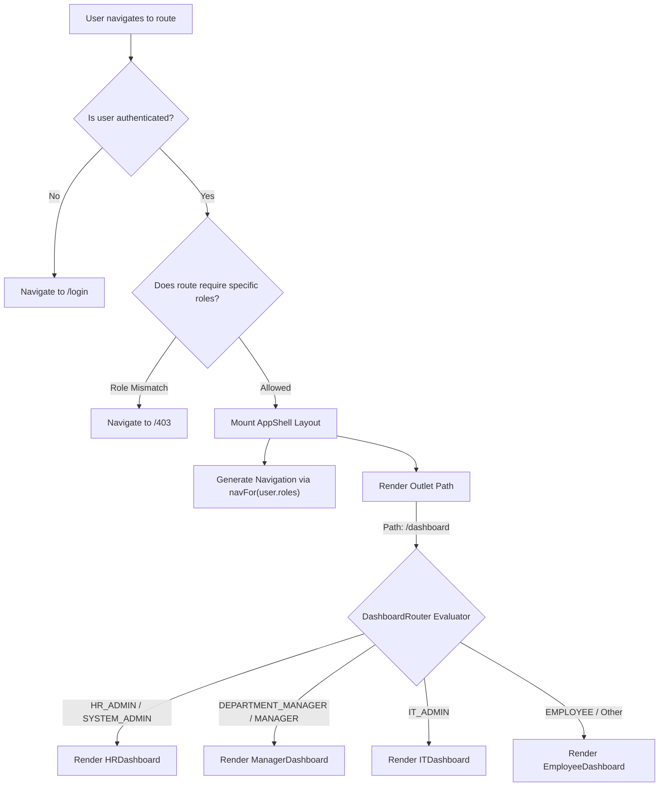

# 🎨 EOMS — Frontend Development & Technology Stack Approaches

> **Employee Onboarding Management System** · React 18 · Vite 5 · Zustand · Styled-Components · Framer Motion · Recharts · Lucide React

---

## 1. Executive Summary

The **Employee Onboarding Management System (EOMS)** frontend is architected as a high-performance, single-page application (SPA) designed for multi-role corporate environments. It delivers an executive-grade user experience tailored to Indian enterprise operations—combining phased onboarding milestones, statutory document verification queues, IT hardware provisioning, and POSH Act compliance reporting into a unified interface.

The design philosophy adopts the **Modern Sage & Slate Design System**, utilizing curated HSL palettes, glassmorphism accents, tabular data alignment, and fluid micro-animations to minimize cognitive friction across HR personnel, IT administrators, compliance auditors, managers, and new hires.

---

## 2. Core Technology Stack Matrix

| Technology | Version | Architectural Role & Purpose |
|---|:---:|---|
| **React** | `18.3.1` | **Component & View Engine**: Declarative UI rendering, Concurrent Mode, hooks-driven reactive architecture. |
| **Vite** | `5.2.11` | **Next-Gen Frontend Tooling**: Native ESM hot-module replacement (HMR), lightning-fast development server, optimized Rollup production bundler. |
| **React Router DOM** | `6.23.1` | **Client-Side Routing Engine**: Nested route configurations, client-side route guards, declarative navigation links. |
| **Zustand** | `4.5.2` | **Client State Management**: Minimalist, unopinionated atomic store with zero boilerplate; local storage persistence middleware (`persist`). |
| **Axios** | `1.7.2` | **HTTP Transport Client**: Request/response interceptors, automatic JWT bearer header injection, and global 401 session clearing. |
| **styled-components** | `6.1.11` | **CSS-in-JS Component Primitives**: Scoped dynamic styling, themeable props (`$variant`, `$dark`, `$size`), clean separation of atomic UI concerns. |
| **Framer Motion** | `13.3.0` | **Micro-interactions & Page Transitions**: Physics-based fluid animations, staggered list rendering, route entry/exit choreography. |
| **GSAP** | `3.15.0` | **Timeline & Complex Motion**: High-performance keyframe animation capabilities for visual dashboards. |
| **Lenis** | `1.3.26` | **Smooth Scroll Engine**: Decoupled momentum scrolling for smooth dashboard transitions. |
| **Recharts** | `3.10.1` | **Data Visualization**: Declarative SVG charting library (MiniDonuts, Area sparklines, trend graphs, horizontal distribution bars). |
| **Lucide React** | `1.46.0` | **Iconography**: Clean, scalable SVG icons with 0 Unicode emoji artifacts for an enterprise aesthetic. |

---

## 3. High-Level Frontend Architecture

```mermaid
graph TD
    subgraph Browser ["Client Runtime (Web Browser)"]
        HTML["index.html (Single Page Root)"]
        Tokens["CSS Token Layer (tokens.css + base.css)"]
        
        subgraph AppCore ["Core Application Architecture"]
            Main["main.jsx (BrowserRouter, StrictMode)"]
            App["App.jsx"]
            Router["AppRoutes.jsx (Dynamic Router)"]
            Guard["RoleRoute.jsx (RBAC Client Guard)"]
            Shell["AppShell.jsx (Collapsible Sidebar, Header, Drawer)"]
        end

        subgraph StateAndNet ["State & Network Layer"]
            Store["Zustand Auth Store (localStorage 'eoms-session')"]
            AxiosClient["Axios HTTP Client (/api/v1 Interceptor)"]
        end

        subgraph UIPrimitives ["Design System Primitives"]
            UIComp["components/common/ui.jsx (Card, Button, Badge, Avatar, Inputs)"]
            ChartsComp["components/common/charts.jsx (Donut, Sparkline, TrendChart)"]
        end

        subgraph FeatureViews ["Feature Slices (/features)"]
            DashHR["HR Dashboard"]
            DashEmp["Employee Dashboard"]
            DashMgr["Manager Dashboard"]
            DashIT["IT Dashboard"]
            EmpDir["Employee Directory"]
            OnbView["Onboarding View"]
            TasksView["Tasks View"]
            DocsView["Documents View"]
            TrainView["Training View"]
            AssetsView["Assets View"]
            AuditView["Audit View"]
            RepView["Reports View"]
        end
    end

    HTML --> Main
    Tokens --> Main
    Main --> App --> Router
    Router --> Guard --> Shell
    Shell --> FeatureViews
    FeatureViews --> UIPrimitives
    FeatureViews --> ChartsComp
    FeatureViews --> Store
    FeatureViews --> AxiosClient
    AxiosClient -.->|Bearer JWT| Store
```



---

## 4. Key Frontend System Design Approaches

### 4.1 Feature-Driven Directory Architecture

The frontend follows a **Feature-Driven Development (FDD)** layout, grouping components, local state, and views by business domain rather than generic technical roles:

```
client/src/
├── api/                   # Centralized Axios client & HTTP interceptors
│   └── client.js
├── components/
│   ├── common/            # Reusable UI primitives & data visualization
│   │   ├── ui.jsx         # Card, Button, Input, Badge, Avatar, Modal, PageHeader
│   │   └── charts.jsx     # MiniDonut, Sparkline, TrendChart, HorizontalBar
│   └── layout/            # Shell structure, navigation bars, responsive containers
│       └── AppShell.jsx
├── features/              # Modular domain feature slices
│   ├── assets/            # IT asset allocation & equipment acknowledgement
│   ├── audit/             # Compliance officer immutable audit trail
│   ├── auth/              # Multi-persona login & MFA screens
│   ├── dashboard/         # Role-specific executive & employee dashboards
│   │   ├── employee/
│   │   ├── hr/
│   │   ├── it/
│   │   └── manager/
│   ├── documents/         # Statutory document review (PAN, Aadhaar, EPFO)
│   ├── employees/         # Employee directory, profile search & filtering
│   ├── notifications/     # System alerts & activity feeds
│   ├── onboarding/        # Phased cohort milestones & timeline management
│   ├── profile/           # User settings, emergency contacts, profile data
│   ├── reports/           # Real-time analytics, SLA tracking & attrition KPIs
│   ├── settings/          # System configuration & deadline parameters
│   ├── tasks/             # Phased task checklists & status updates
│   └── training/          # POSH Act & InfoSec regulatory training modules
├── routes/                # Client routing & permission guards
│   ├── AppRoutes.jsx      # Main route declarations & Dynamic Dashboard Router
│   └── RoleRoute.jsx      # Authentication & RBAC navigation guard
├── store/                 # Global state management
│   └── authStore.js       # Zustand persistent session & role store
├── styles/                # Global design system & design tokens
│   ├── tokens.css         # CSS custom properties (colors, typography, shadows)
│   └── base.css           # Global typography scale, resets & scrollbar styling
└── utils/                 # Shared utilities
    └── navigation.js      # Dynamic role-to-navigation matrix
```

---

### 4.2 Hybrid Design System & Token Architecture

The UI avoids bulky CSS frameworks in favor of a **tailored, tokenized CSS & Styled-Components architecture**:

1. **Design Tokens (`styles/tokens.css`)**:
   - Curated **Sage Green** corporate palette (`--sage-50` to `--sage-900`) representing harmony and modern productivity.
   - **Dark Panel Accent** (`--dark-panel: #1C2B20`) providing visual contrast.
   - **Semantic Status Signals**:
     - `success`: `#22C55E` (On Track / Approved)
     - `warning`: `#F59E0B` (Needs Review / In Progress)
     - `danger`: `#F43F5E` (Overdue / Blocked / SLA Breach)
     - `info`: `#3B82F6` (Queued / Scheduled)
   - **Warm Green-Tinted Shadows** (`--shadow-xs` to `--shadow-xl`) to achieve visual depth without murky gray tones.
   - Fully rounded pills (`--r-full: 9999px`) for action buttons, chips, and badges.

2. **Typography Architecture (`styles/base.css`)**:
   - Google Font: **Inter** with active OpenType font feature flags (`"kern" 1`, `"liga" 1`).
   - Tabular Numerals (`"tnum" 1` via `.num`, `.kpi`, `.stat-val`) ensuring numeric data in tables and KPI cards aligns predictably.
   - Dedicated Executive KPI Display Scale (`.kpi-xl` at `3.25rem`, `.kpi-lg` at `2.25rem`, `.kpi-md` at `1.75rem`).

3. **Atomic Component Primitives (`components/common/ui.jsx`)**:
   - Built with `styled-components` wrapping design tokens for consistency:
     - `Card` & `TintedCard`: Surfaces with hover elevation and dark variants.
     - `Button`: Dark-pill aesthetic with variants (`primary`, `secondary`, `soft`, `ghost`, `danger`, `dark`) and integrated loader state.
     - `Badge`: Status tags with matching pulse indicator dots.
     - `Avatar`: Fallback initials generator with consistent hue distribution.
     - `Input`, `Select`, `Label`: Form controls with focus rings (`var(--primary-ring)`).

---

### 4.3 State Management & Session Lifecycle (Zustand)

EOMS uses **Zustand** for lightweight, boilerplate-free state management:

```mermaid
flowchart LR
    subgraph UI ["Component Tree"]
        Login["LoginPage"]
        Nav["AppShell / NavLink"]
        Routes["RoleRoute"]
    end

    subgraph Store ["Zustand Store (authStore.js)"]
        State["{ token, user: { id, username, roles, dept, hub } }"]
        Actions["login(), logout(), setSession()"]
    end

    subgraph Storage ["Browser Local Storage"]
        LS[("key: 'eoms-session'")]
    end

    subgraph Network ["Axios Client (api/client.js)"]
        ReqInt["Request Interceptor (Attach Bearer Token)"]
        ResInt["Response Interceptor (Catch 401 -> Logout)"]
    end

    Login -->|calls login()| Actions
    Actions --> State
    State <-->|persist middleware| LS
    Routes -->|reads user / roles| State
    Nav -->|reads user| State
    ReqInt -->|useAuthStore.getState().token| State
    ResInt -->|useAuthStore.getState().logout()| Actions
```

#### Key Store Capabilities:
- **Instant Dev Velocity & Persona Switching**: Pre-configured demo accounts (`priya.patel`, `aarav.sharma`, `vikram.malhotra`, `rohan.verma`, `admin`, `neha.nair`) for one-click cross-persona testing.
- **Zero-Pollution Decoupling**: Outside the React lifecycle (e.g. inside Axios interceptors), state is accessed directly via `useAuthStore.getState()` without React context hooks.
- **Storage Resiliency**: User state persists across browser reloads via the `persist` middleware.

---

### 4.4 Dynamic Role-Based Routing & Dashboard Orchestration

The application uses **React Router DOM v6** combined with dynamic role mapping:



#### Dynamic Navigation Tree (`utils/navigation.js`):
Instead of a static navigation sidebar, `navFor(roles)` calculates accessible routes based on the active role:
- **System Admin**: Platform control, user management, audit logs, system settings.
- **HR Admin**: Cohort orchestrator, employee onboarding plans, statutory document queue.
- **IT Admin**: Hardware allocation, equipment inventory, provisioning queues.
- **Manager**: Team progress tracker, buddy pairings, 30-day milestones.
- **Employee**: Task checklist, document upload portal, POSH training modules.

---

### 4.5 Data Visualization Architecture (Recharts Integration)

Analytics dashboards leverage **Recharts** with customized styling:

1. **MiniDonut**: High-density completion gauge with embedded progress percentage and total counts (`value / total`), animated with smooth easing.
2. **Sparkline**: Area chart with vertical linear gradient fills, illustrating completion velocity and SLA trends.
3. **TrendChart**: Multi-series area chart tracking completion rates across onboarding cohorts.
4. **HorizontalBar**: Normalized department distribution bars for departmental headcount and task completion comparisons.
5. **MinimalTooltip**: Custom HTML tooltip matching design system tokens (`var(--bg-surface)` and `var(--border-subtle)`), overriding default Recharts styling.

---

### 4.6 Fluid Motion & Micro-interactions (Framer Motion)

Motion is used purposefully to provide feedback and indicate spatial hierarchy:

- **Page Transitions**: Smooth slide-fade transitions (`PAGE_VARIANTS` with cubic bezier curve `[0.16, 1, 0.3, 1]`).
- **Staggered Lists**: `AnimatedList` and `AnimatedItem` components reveal table items and activity feeds sequentially.
- **Micro-interactions**: Hover elevation on cards, interactive button press feedback, and animated spinners during asynchronous operations.
- **Accessibility Safeguard**: Respects user motion preferences via the `@media (prefers-reduced-motion: reduce)` media query in `base.css`.

---

### 4.7 API Transport & Resilience Layer

The HTTP layer is encapsulated in `api/client.js`:

```javascript
import axios from 'axios';
import { useAuthStore } from '../store/authStore';

export const api = axios.create({ baseURL: '/api/v1' });

// Request Interceptor: Inject JWT token into Bearer header
api.interceptors.request.use(cfg => {
  const token = useAuthStore.getState().token;
  if (token) cfg.headers.Authorization = `Bearer ${token}`;
  return cfg;
});

// Response Interceptor: Automatically clear expired sessions
api.interceptors.response.use(null, err => {
  if (err.response?.status === 401) {
    useAuthStore.getState().logout();
  }
  return Promise.reject(err);
});
```

---

## 5. Screen & Feature Design Flows

### 5.1 Multi-Persona Authentication Flow (`LoginPage.jsx`)
- **Split-Screen Design**:
  - *Left Panel*: High-contrast branded dark panel (`--sage-900`) highlighting platform metrics (Active Plans, SLA Rate, Indian tech hub badges).
  - *Right Panel*: Clean login form with toggleable password visibility and **Quick Sign-in Persona Chips** for rapid role switching.

### 5.2 Responsive Workspace Layout (`AppShell.jsx`)
- **Collapsible Sidebar**: Shrinks from `220px` to `56px` for dense data workflows while keeping tooltip labels visible.
- **Mobile Sheet / Drawer**: Slides out on narrow viewports for mobile accessibility.
- **Live Search & Quick Help**: Integrated header search bar and support links.

### 5.3 Phased Onboarding & Tasks Flow
- Checklists organized into distinct chronological phases: `Pre-Boarding`, `Day One`, `Week One`, and `Month One`.
- Interactive checkboxes trigger immediate optimistic UI updates while recalculating progress bars in real time.

### 5.4 Statutory Document Verification Queue
- Dedicated verification cards for Indian compliance filings: **PAN Card**, **Aadhaar Card**, **EPFO Form 11**, and **Educational Certificates**.
- Auditors can preview document status, add audit notes, and approve or reject filings directly from the queue.

---

## 6. Performance, Accessibility & Scalability

| Category | Architectural Implementation |
|---|---|
| **Performance** | • Vite ES module bundling with code-splitting.<br>• Tabular number rendering prevents layout shifts during live metric updates.<br>• Native SVG icon rendering with Lucide React (zero heavy icon fonts). |
| **Accessibility (a11y)** | • High contrast ratio compliant with WCAG AA guidelines.<br>• Visible focus states (`:focus-visible` with 2px primary ring and offset).<br>• `prefers-reduced-motion` overrides all animations to 0.01ms for sensitive users. |
| **Scalability** | • Strict feature-sliced directory structure allows adding new modules (e.g. Payroll, Benefits) without modifying existing views.<br>• Reusable UI primitives ensure new features stay consistent with the design system. |
| **Developer Experience** | • Instant Vite HMR during local development.<br>• Pre-configured demo users in Zustand eliminate dependencies on a running backend during UI development. |

---

## 7. Frontend Technology Stack Summary Table

```
EOMS Client Application
├── Runtime Environment: Browser (ES2022+)
├── Core Framework: React 18.3 (Hooks, Suspense, StrictMode)
├── Build Tool: Vite 5.2 + @vitejs/plugin-react
├── Navigation: React Router DOM 6.23 (Nested & Protected Routes)
├── State Management: Zustand 4.5 (Persisted Local Session)
├── Styling Engine: Styled-Components 6.1 + CSS Tokens (Sage Palette)
├── UI Primitives: Handcrafted Atomic Component Library
├── Data Visualization: Recharts 3.10 (Responsive SVG Charts)
├── Animation Suite: Framer Motion 13.3 + GSAP 3.15 + Lenis 1.3
├── Iconography: Lucide React 1.46 (Enterprise Scalable SVGs)
└── Network Client: Axios 1.7 (Bearer Interceptor + 401 Ejection)
```
