# 🏢 EOMS — Backend System Design Document

> **Employee Onboarding Management System** · Node.js 24 · Express 4 · MySQL 8.0 · Sequelize 6

---

## 1. Executive Summary

EOMS is a **monolithic REST API** built around a stateless, layered MVC architecture. It serves as the authoritative backend for a multi-role HR platform that automates the entire employee onboarding lifecycle — from pre-boarding document collection to Day-30 independent delivery — while enforcing Indian statutory compliance (PAN, Aadhaar, EPFO, POSH Act 2013).

---

## 2. High-Level Architecture — Three-Tier Model

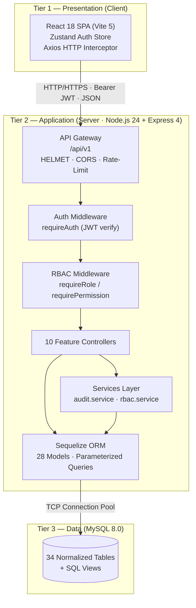

---

## 3. Architectural Patterns Used

### 3.1 MVC (Model-View-Controller)

| Layer | Location | Responsibility |
|---|---|---|
| **Model** | `server/src/models/` | 28 Sequelize entity models, all DB I/O |
| **View** | JSON REST responses | Serialized JavaScript objects returned by controllers |
| **Controller** | `server/src/controllers/` | Business logic, request/response handling |

> The "View" in a REST API is the JSON response. There are no server-rendered HTML views.

---

### 3.2 Layered (N-Tier) Architecture

The request pipeline flows through a strict sequence of layers. No layer is skipped.

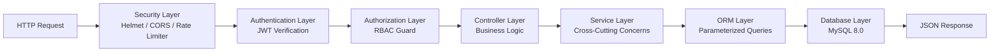

---

### 3.3 Repository / ORM Pattern

- All database access is abstracted through **Sequelize models** — controllers never write raw SQL.
- **Parameterized queries** are used everywhere, preventing SQL injection.
- The `models/index.js` file is the single source of truth for all entity **associations**.

---

### 3.4 Service Layer Pattern

Two dedicated services handle **cross-cutting concerns**:

| Service | File | Responsibility |
|---|---|---|
| `audit.service` | `services/audit.service.js` | Writes immutable audit log entries to `audit_logs` for every state-altering action |
| `rbac.service` | `services/rbac.service.js` | Queries the `roles → user_roles` join to resolve a user's role array at login time |

> Controllers call `logAudit(...)` after every write operation (`CREATE_EMPLOYEE`, `LOGIN`, `MFA_FAILED`, etc.)

---

### 3.5 Middleware Chain Pattern

Express middleware is composed in order to create a **pipeline** that can short-circuit at any point:

```
Request → Helmet → CORS → JSON Parser → Rate Limiter → Router
       → requireAuth → requireRole/requirePermission → Controller → Error Handler
```

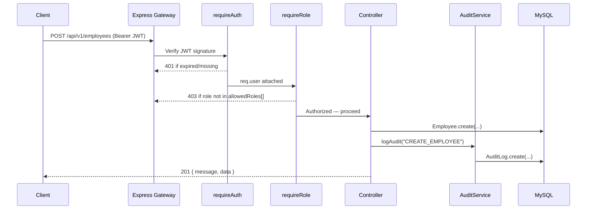

---

### 3.6 Role-Based Access Control (RBAC) — Hierarchical + Permission-Based

EOMS implements a **dual-mode RBAC** system:

#### Mode A — Role Guard (`requireRole`)
Fast, in-memory check. Reads `req.user.roles[]` embedded in the JWT. No DB query required.

```
SYSTEM_ADMIN → superuser bypass (always passes)
HR_ADMIN     → can create employees, manage onboarding
IT_ADMIN     → can allocate assets
COMPLIANCE   → can verify documents
EMPLOYEE     → self-service only
```

#### Mode B — Permission Guard (`requirePermission`)
Fine-grained check. Queries `permissions → role_permissions → user_roles` for the user's `action_name` set.  
Result is **cached in-process** for 60 seconds via a `Map<userId, Set<action_name>>` to avoid repeated DB queries.

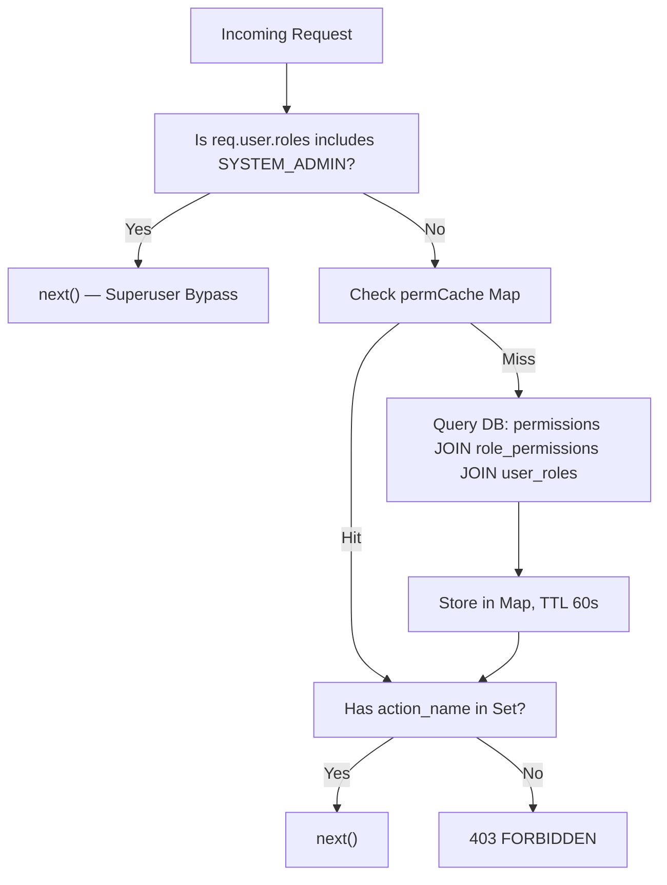

#### RBAC Hierarchy Table

| Role | Level | Key Permissions |
|---|:---:|---|
| `SYSTEM_ADMIN` | 1 | `*` All actions bypass |
| `HR_ADMIN` | 2 | `employee:*`, `onboarding:*`, `task:*`, `report:view` |
| `HR_SPECIALIST` | 3 | `employee:read`, `onboarding:*`, `task:*` |
| `COMPLIANCE_OFFICER` | 4 | `document:verify`, `document:read`, `audit:view` |
| `IT_ADMIN` | 5 | `asset:*`, `task:write`, `employee:read` |
| `DEPARTMENT_MANAGER` | 7 | `onboarding:read`, `task:write`, `employee:read` |
| `EMPLOYEE` | 9 | `task:write`, `document:upload`, `training:write` |
| `PAYROLL_ADMIN` | 10 | `document:read`, `employee:read` |

---

## 4. Authentication Flow — Stateless JWT + Optional MFA

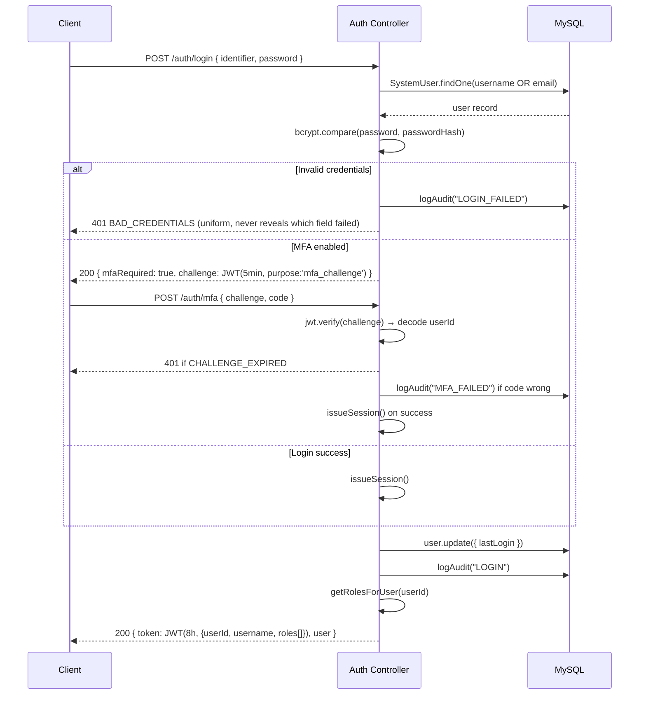

**Key design decisions:**
- **Uniform error message** — never reveals which field (username vs password) was wrong.
- **Stateless JWT** — no server-side sessions or token store; validation is pure cryptography.
- **8-hour TTL** — balances UX convenience with security.
- **MFA challenge token** — a short-lived (5-min) JWT avoids needing a session store for MFA state.
- Every login attempt (success or failure) is written to `audit_logs`.

---

## 5. Database Design — 7 Functional Domains (34 Tables)

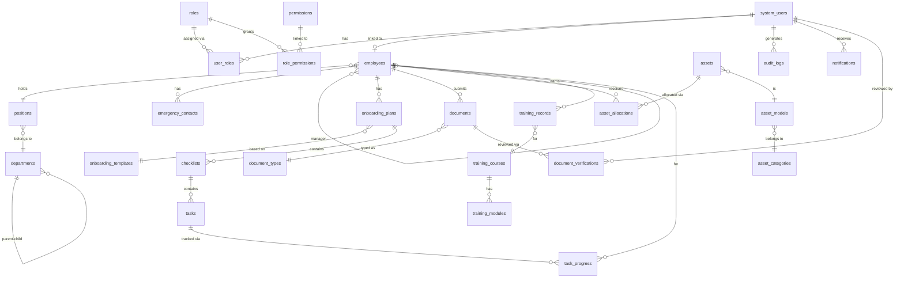

### Domain Breakdown

| # | Domain | Tables | Purpose |
|---|---|---|---|
| 1 | **IAM** | `system_users`, `roles`, `user_roles`, `permissions`, `role_permissions` | Authentication, authorization |
| 2 | **Org Hierarchy** | `departments`, `positions`, `employees`, `emergency_contacts` | Corporate structure |
| 3 | **Onboarding Engine** | `onboarding_templates`, `onboarding_plans`, `checklists`, `tasks`, `task_progress` | Phased onboarding lifecycle |
| 4 | **Compliance Docs** | `document_types`, `documents`, `document_verifications` | Statutory document audit |
| 5 | **IT Assets** | `asset_categories`, `asset_models`, `assets`, `asset_allocations` | Hardware provisioning |
| 6 | **LMS & Training** | `training_courses`, `training_modules`, `training_records` | Mandatory regulatory training |
| 7 | **Observability** | `audit_logs`, `notifications`, `system_settings` | Audit trail, alerting, config |

---

## 6. API Design — RESTful Resource Model

EOMS follows the **REST architectural style** with a versioned base path (`/api/v1`).

### Design Principles Applied
- **Nouns for resources**, verbs for HTTP methods (`/employees` not `/getEmployees`)
- **HTTP semantics**: `GET` (read), `POST` (create), `PATCH` (partial update)
- **Versioned API** (`/api/v1/...`) for forward compatibility
- **Consistent error envelopes**: `{ code: "VALIDATION_ERROR", message: "..." }`
- **Consistent success envelopes**: `{ data: [...] }` or `{ message: "...", data: {...} }`

### Endpoint Map

| Method | Path | Auth Required | Role Guard |
|---|---|---|---|
| `POST` | `/auth/login` | ❌ Public | — |
| `GET` | `/auth/me` | ✅ JWT | Any |
| `GET` | `/employees` | ✅ JWT | Any |
| `POST` | `/employees` | ✅ JWT | `HR_ADMIN`, `HR_SPECIALIST` |
| `PATCH` | `/employees/:id` | ✅ JWT | `HR_ADMIN` |
| `GET` | `/onboarding` | ✅ JWT | Any |
| `GET` | `/tasks` | ✅ JWT | Any |
| `PATCH` | `/tasks/:id/progress` | ✅ JWT | Any |
| `GET` | `/documents` | ✅ JWT | Any |
| `POST` | `/documents/upload` | ✅ JWT | Any |
| `PATCH` | `/documents/:id/verify` | ✅ JWT | `COMPLIANCE_OFFICER`, `HR_ADMIN` |
| `GET` | `/assets` | ✅ JWT | Any |
| `POST` | `/assets/allocate` | ✅ JWT | `IT_ADMIN` |
| `PATCH` | `/assets/allocations/:id/acknowledge` | ✅ JWT | Any |
| `GET` | `/training/courses` | ✅ JWT | Any |
| `POST` | `/training/progress` | ✅ JWT | Any |
| `GET` | `/reports/summary` | ✅ JWT | HR, IT, Compliance, Managers |
| `GET` | `/audit` | ✅ JWT | `SYSTEM_ADMIN`, `COMPLIANCE_OFFICER` |
| `GET` | `/settings` | ✅ JWT | Any |
| `GET` | `/health` | ❌ Public | — |

---

## 7. Security Architecture — Defense in Depth

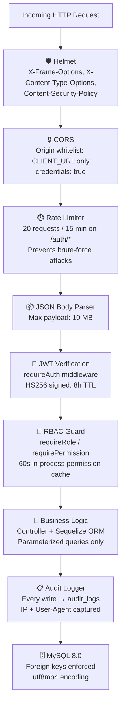

### Security Controls Summary

| Control | Implementation | Threat Mitigated |
|---|---|---|
| **Helmet HTTP headers** | `helmet()` middleware | XSS, Clickjacking, MIME sniffing |
| **CORS whitelist** | `origin: process.env.CLIENT_URL` | Cross-origin API abuse |
| **Rate limiting** | 20 req / 15 min on `/auth/*` | Brute-force credential attacks |
| **Bcrypt hashing** | 10 salt rounds | Password breach exposure |
| **JWT stateless auth** | HS256, 8h expiry | Session hijacking |
| **Uniform auth errors** | Same message for wrong user vs wrong password | User enumeration attacks |
| **Parameterized queries** | Sequelize ORM throughout | SQL injection |
| **Audit immutability** | Every write calls `logAudit()` | Forensic traceability |
| **MFA challenge JWT** | 5-min short-lived token | MFA replay attacks |
| **SYSTEM_ADMIN bypass** | Superuser shortcircuit in all guards | Operational lockout prevention |

---

## 8. Onboarding Business Logic — Phased Workflow Engine

When HR creates a new employee, an **automated chain of operations** is triggered:

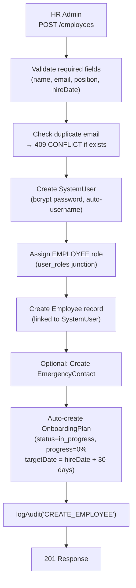

### Task Progress Auto-Calculation
When an employee marks a task complete via `PATCH /tasks/:id/progress`, the controller:
1. Updates `task_progress.status = 'completed'`
2. Recalculates `onboarding_plans.progress_percent` = (completed tasks / total tasks) × 100
3. Auto-transitions plan `status` to `'completed'` when `progress_percent = 100`

### Phased Checklist Structure

```
OnboardingPlan
└── Checklist: "Pre-Boarding"      (tasks due before Day 1)
└── Checklist: "Day One"           (tasks due on first day)
└── Checklist: "Week One"          (tasks due in first week)
└── Checklist: "Month One"         (tasks due in first 30 days)
```

---

## 9. IT Asset Provisioning Flow

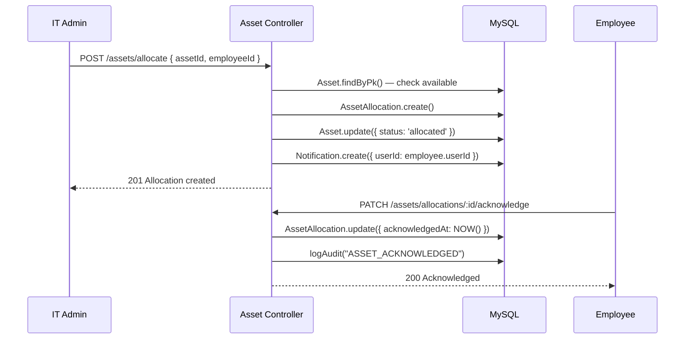

---

## 10. Statutory Compliance Document Flow

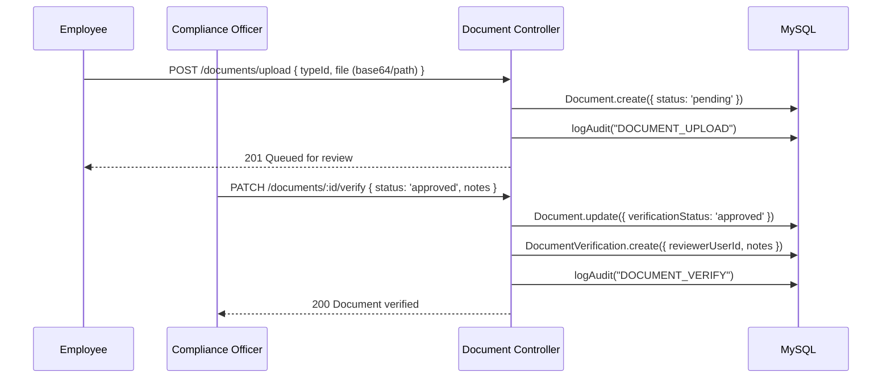

**Supported document types:** PAN Card · Aadhaar Card · EPFO Form 11 · Educational Degree Certificate

---

## 11. Error Handling Architecture

A centralized **error handler middleware** (`middleware/error.js`) catches all unhandled errors:

```
Controller throws (or calls next(err))
    → error.js middleware intercepts
    → Serializes to { code, message }
    → 500 errors are automatically audited
    → No stack traces leak to client in production
```

All controller methods wrap their logic in `try/catch` → `next(e)` for graceful error propagation.

---

## 12. Testing Architecture — 3-Layer Strategy

| Layer | Command | Scope |
|---|---|---|
| **Unit Tests** | `npm run test:unit` | Bcrypt, JWT, RBAC guards, Sequelize models |
| **Integration Tests** | `npm run test:integration` | Live REST API endpoints, headers, role guards |
| **E2E Tests** | `npm run test:e2e` | Full 4-persona lifecycle simulation |

**Test runner:** Node.js native `node:test` + `node:assert/strict` (zero external dependencies).

### E2E Persona Flow
```
Phase 1: Multi-persona authentication (HR, IT, Employee, Compliance)
Phase 2: HR Admin creates employee + onboarding plan
Phase 3: IT Admin allocates hardware to new employee
Phase 4: Employee completes tasks + uploads PAN card
Phase 5: Compliance Officer audits and approves the statutory document
```
**Result: 24 tests · 5 suites · 0 failures**

---

## 13. Deployment Architecture — Docker Compose

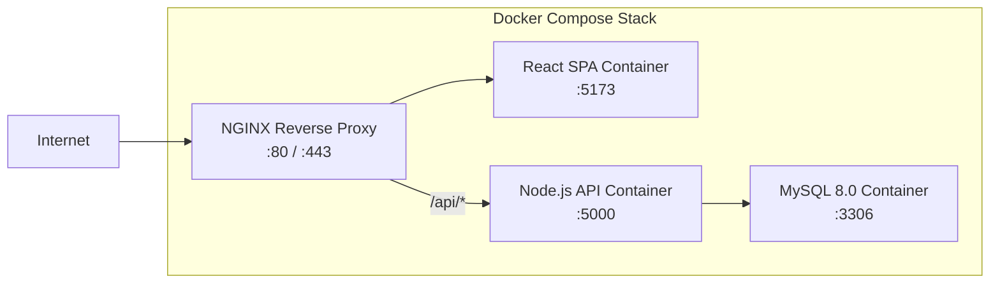

- **`deployment/`** contains `docker-compose.yml`, `deploy.sh` (Linux/macOS), `deploy.ps1` (Windows)
- Server reads config from `server/.env` (never committed — `.gitignore` protected)
- Automated deployment: `docker-compose up --build -d`

---

## 14. Component Dependency Map

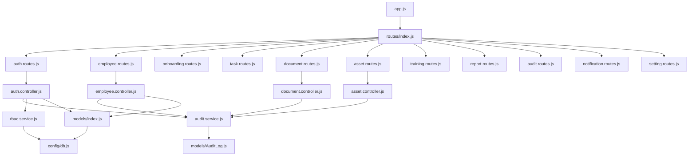

---

## 15. Key Design Decisions & Tradeoffs

| Decision | Choice Made | Rationale |
|---|---|---|
| **Architecture style** | Monolith (not microservices) | Team size, deployment simplicity, single domain |
| **Session strategy** | Stateless JWT | No Redis/session store needed; horizontally scalable |
| **ORM vs raw SQL** | Sequelize ORM | Type safety, parameterized queries, association graph |
| **RBAC caching** | In-process `Map` (60s TTL) | Avoids DB round-trip per request without Redis dependency |
| **Error uniformity** | Generic auth messages | Prevents user enumeration attacks |
| **Test runner** | `node:test` (native) | Zero external dependencies, ships with Node.js 24 |
| **Database** | MySQL 8.0 (relational) | Strong FK constraints needed for compliance audit trail |
| **Frontend state** | Zustand (not Redux) | Lightweight, no boilerplate for simple auth state |
